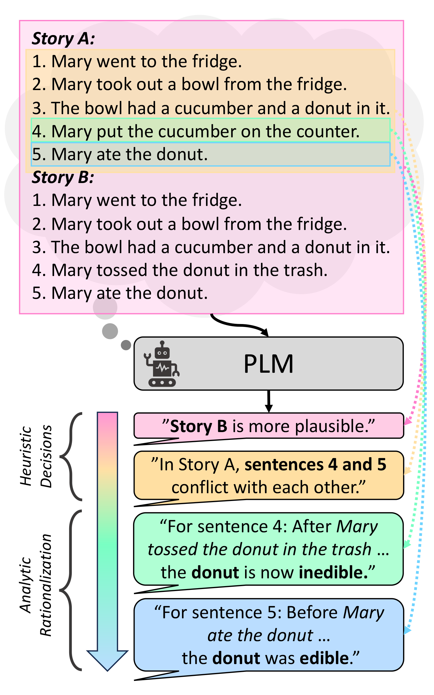

# Heuristic-Analytic Reasoning (HAR)

Repo for the EMNLP 2023 paper "From Heuristic to Analytic: Cognitively-Motivated Reasoning Strategies for Coherent Physical Commonsense Reasoning."

[arXiv](https://arxiv.org/abs/2310.18364)



## Before We Start

1. Set up the virtual environment:

```
conda env create -f requirements.yml
conda activate har
python -m spacy download en_core_web_sm
```

2. Download the cached LLM API outputs from [Google Drive](https://drive.google.com/drive/folders/1oIf4tpxHH50xr2DnkKBQnFrFhsj2j66l?usp=drive_link). Place `HAR_all_cache_files_2023oct20.zip` in the `ICL` directory and unzip to create folder `cache_files`:

```
unzip ICL/HAR_all_cache_files_2023aug30.zip -d cache_files
rm HAR_all_cache_files_2023aug30.zip
```

3. Download `glove.6B.50d.txt` into the folder:

```
cd ICL
wget https://nlp.stanford.edu/data/glove.6B.zip
unzip glove.6B.zip -d glove.6B
rm glove.6B.zip
```

We only need `glove.6B.50d.txt``, you can delete the other glove files if space is an issue.

4. Download the pre-trained HAR models from [Google Drive](https://drive.google.com/drive/folders/1oIf4tpxHH50xr2DnkKBQnFrFhsj2j66l?usp=drive_link). Place `pretrained_model_trip.zip` in the `gradient-based/gradient-based-trip` directory, and `pretrained_model_propara.zip` in the `gradient-based/gradient-based-trip` directory. Then unzip:

```
cd ../gradient-based/gradient-based-trip
unzip pretrained_model_trip.zip
rm pretrained_model_trip.zip

cd ../gradient-based-propara
unzip pretrained_model_propara.zip
rm pretrained_model_propara.zip
```

## Fine-Tuning Experiments

To reproduce FCGLI and FCGLI-HAR results, you can either re-evaluate the pre-trained models or re-train them from scratch. 

Note that evaluation metrics from fine-tuning experiments are reported in the paper as an average of 3 runs where models were initialized with different random seeds. As the results from pre-trained models are only from one run (random seed 42), they will not match the paper exactly. For a full reproduction, train multiple instances of the model from scratch.

Before running any scripts, navigate to the `./gradient-based` folder:

```
cd gradient-based
```

### FCGLI

#### TRIP

Before reproducing TRIP results, navigate to the appropriate subfolder:

```
cd gradient-based-trip/src
```

To evaluate the pre-trained FCGLI model on the TRIP dataset, run the following command:

```
python main_story.py --output_dir ../pretrained_model/trip_baseline_output --do_eval --dataset_name trip --model baseline-mixed
```

Or to re-train it from scratch, run the following command:

```
python main_story.py --output_dir ../output --do_train --do_eval --dataset_name trip --model baseline-mixed
```

#### Tiered-ProPara

Before reproducing Tiered-ProPara results, navigate to the appropriate subfolder:

```
cd gradient-based-propara/src
```

To evaluate the pre-trained FCGLI model on the Tiered-ProPara dataset, run the following command:

```
python main_story.py --output_dir ../pretrained_model/propara_baseline_output --do_eval --dataset_name propara-conversion --model baseline-mixed
```

Or to re-train it from scratch, run the following command:

```
python main_story.py --output_dir ../output --do_train --do_eval --dataset_name propara-conversion --model baseline-mixed
```

### FCGLI-HAR

#### TRIP

Before reproducing TRIP results, navigate to the appropriate folder:

```
cd gradient-based-trip/src
```

To evaluate the pre-trained FCGLI-HAR model on the TRIP dataset, run the following command:

```
python main_story.py --output_dir ../pretrained_model/trip_har_output --do_eval --dataset_name trip --model top-down
```

Or to re-train it from scratch, run the following command:

```
python main_story.py --output_dir ../output --do_train --do_eval --dataset_name trip --model top-down
```

#### Tiered-ProPara

Before reproducing Tiered-ProPara results, navigate to the appropriate folder:

```
cd gradient-based-propara/src
```

To evaluate the pre-trained FCGLI-HAR model on the Tiered-ProPara dataset, run the following command:

```
python main_story.py --output_dir ../pretrained_model/propara_har_output --do_eval --dataset_name propara-conversion --model top-down
```

Or to re-train it from scratch, run the following command:

```
python main_story.py --output_dir ../output --do_train --do_eval --dataset_name propara-conversion --model top-down
```

## In-Context Learning (ICL) Experiments

ICL experiments (introduced in Section 5.1) can be reproduced using cached LLM outputs that were unzipped above. If you want to rerun the results from scratch, you should remove the `--cache_only` flag, and if using `gpt3`, provide the `--api_key` flag for your Azure OpenAI instance API key.

**Note: If you run the code with the `--cache_only` flag but have not unzipped the cached LLM API outputs as described above in Before We Start, the code will fail with a cryptic error.**

Before running any scripts, navigate to the `./ICL` folder:

```
cd ICL
```

### Unstructured Baseline (ICL-U)

#### TRIP

Run the following commands to reproduce ICL-U results on the TRIP dataset.

##### InstructGPT

```
python3 trip_baseline_separate.py --lm_backbone gpt3 --cache_only
```

##### LLaMA-65B

```
python3 trip_baseline_separate.py --lm_backbone llama65b --reduce_options --cache_only
```

#### Tiered-ProPara

Run the following commands to reproduce ICL-U results on the Tiered-ProPara dataset.

##### InstructGPT

```
python3 propara_baseline_separate.py --lm_backbone gpt3 --cache_only
```

##### LLaMA-65B

```
python3 propara_baseline_separate.py --lm_backbone llama65b --cache_only
```

### Chain-of-Thought (ICL-CoT) Baseline

This chain-of-thought (CoT) baseline was implemented during our rebuttal period, and will be added in a later revision of the paper. 

We attempted to integrate CoT into our framework by augmenting the ICL-U prompts for each of the 3 sub-tasks (i.e., story selection, sentence selection, and state prediction) with free-text explanations. These explanations are generated by the LLM by prompting it with “Think step by step” after the sub-task context for each in-context demonstration and the testing example being solved, then they’re appended to the prompt. This gave us a few-shot CoT method that applies to our task. The results below show that applying traditional CoT (ICL-CoT) doesn’t improve performance much. Further, we observed that the generated reasoning explanations tend to iterate through sentences in stories to do step by step reasoning upon them, which doesn’t add useful information to the problem or simplify it- the model still needs to make predictions on lower-level tasks from a large context with a lot of irrelevant information. Therefore, we proposed HAR, a method that can use high-level (heuristic) predictions to focus on the correct context for low-level (analytic) predictions.

#### TRIP

Run the following commands to reproduce ICL-CoT results on the TRIP dataset.

##### InstructGPT
```
python3 trip_baseline_separate_cot.py --lm_backbone gpt3 --cache_only
```

##### LLaMA-65B
```
python3 trip_baseline_separate_cot.py --lm_backbone llama65b --reduce_options --cache_only
```

#### Tiered-ProPara

Run the following commands to reproduce ICL-CoT results on the Tiered-ProPara dataset.

##### InstructGPT
```
python3 propara_baseline_separate_cot.py --lm_backbone gpt3 --cache_only
```

##### LLaMA65B
```
python3 propara_baseline_separate_cot.py --lm_backbone llama65b --cache_only
```

### Heuristic-Analytic Reasoning (ICL-HAR)

#### TRIP

Run the following commands to reproduce ICL-HAR results on the TRIP dataset.

##### InstructGPT

```
python3 trip_soft_chaining.py --lm_backbone gpt3 --cache_only
```

##### LLaMA-65B

```
python3 trip_soft_chaining.py --lm_backbone llama65b --reduce_options --cache_only
```

#### Tiered-ProPara

Run the following commands to reproduce ICL-HAR results on the Tiered-ProPara dataset.

##### InstructGPT 

```
python3 propara_soft_chaining.py --lm_backbone gpt3 --cache_only
```

##### LLaMA-65B
```
python3 propara_soft_chaining.py --lm_backbone llama65b --cache_only
```

### Attention Analysis on LLaMA65B Model Outputs

Note that we could only perform attention analysis on LLaMA-65B as it is open-sourced. Attention weights were not available from the InstructGPT model. When results are printed, "2nd Level" and "3rd Level" metrics respectively refer to the Sentence Selection Step and Physical State Prediction Step results as reported in Table 4 of the paper.

#### TRIP

Run the following commands to reproduce attention analysis results and visualizations on the TRIP dataset.

##### ICL-U Baseline Attention Analysis

```
python3 trip_baseline_separate.py --lm_backbone llama65b --reduce_options --analyze_attention --cache_only
python3 trip_baseline_separate_visualization.py --lm_backbone llama65b --reduce_options --cache_only
```

##### HAR Attention Analysis

```
python3 trip_soft_chaining.py --lm_backbone llama65b --reduce_options --analyze_attention --cache_only
python3 trip_soft_chaining_visualization.py --lm_backbone llama65b --reduce_options --cache_only
```


#### Tiered-ProPara

Run the following commands to reproduce attention analysis results and visualizations on the Tiered-ProPara dataset.

##### ICL-U Baseline Attention Analysis

```
python3 propara_baseline_separate.py --lm_backbone llama65b --analyze_attention --cache_only
python3 propara_baseline_separate_visualization.py --lm_backbone llama65b --cache_only
```

##### HAR Attention Analysis

```
python3 propara_soft_chaining.py --lm_backbone llama65b --analyze_attention --cache_only
python3 propara_soft_chaining_visualization.py --lm_backbone llama65b --cache_only
```


# Citation
```
@inproceedings{zhang-etal-2023-heuristic,
    title = "From Heuristic to Analytic: Cognitively Motivated Strategies for Coherent Physical Commonsense Reasoning",
    author = "Zheyuan Zhang and Shane Storks and Fengyuan Hu and Sungryull Sohn and Moontae Lee and Honglak Lee and Joyce Chai",
    booktitle = "Proceedings of the 2023 Conference on Empirical Methods in Natural Language Processing",
    month = dec,
    year = "2023",
    address = "Singapore",
    publisher = "Association for Computational Linguistics",
}
```
